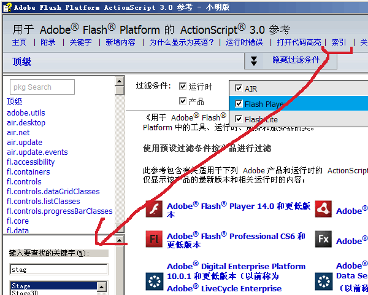

#### AS3 CHM 参考手册

------


#### 已经压缩好了的 CHM 离线手册 :package:[百度网盘](http://pan.baidu.com/s/1ntHSwOh)

 * Adobe Flash Player 14.0 和更低版本
 * Adobe Flash Professional CS6 和更低版本
 * Adobe AIR 14.0 和更低版本
 * Adobe Flex 4.6 和更低版本

##### 注意

 * 此CHM不包含 **lc, com, ga, coldfusion, xd**  这几个包, 如果需要修改 `config.js` 然后重新编译
 
 * 仅限 windows 系统
 
 * 如打开空白, 尝试 **文件属性** -> **解除锁定** 

 * 推荐使用 **索引** 搜索 类(`class`) 及 函数(`Function`) (注:不包括类方法及类属性) 如下图: 



#### 如何制做:

 *  配置
 
  - 下载Adobe 原始ZIP档案 [http://help.adobe.com/zh_CN/FlashPlatform/reference/actionscript/3/PlatformASR_Final_zh-cn.zip](http://help.adobe.com/zh_CN/FlashPlatform/reference/actionscript/3/PlatformASR_Final_zh-cn.zip)

  - 调整好 `config.js` 的 source 和 output 目录,将原始zip 解压到 source

		> 本文档目录看起像:
		```bash
		top
		 ├─ origin/	# 将原始 ZIP 档案解压在这
		 ├─ output/	# output文件夹 配置文件会自动创建. 	
		 └─ mark/	# for Nodejs
		```
  - **注意:**请配置好 `config.logdir` 的磁盘位置.		

 * make
  
  - 参看 `mark/Makefile` 文件 

  - `Cygwin` 环境中在 `mark` 目录下 直接输入 `make` 将自动完成所有文件字符替换

 * 使用 [HTML Help Workshop](http://www.microsoft.com/en-us/download/details.aspx?id=21138#system-requirements)

  - 只需要把 index.html 和 link4chm.html 添加进去,然后打包就行了

  - **注意:** 打包时需要将 `.hhp` 放在 output 文件夹中.

 
#### 其它

 * 这里的文件不包含 swf 的源码

	> 源文件已经缺失, 功能很简单, 只做了类似于 cookie 和 Ajax 的操作,
